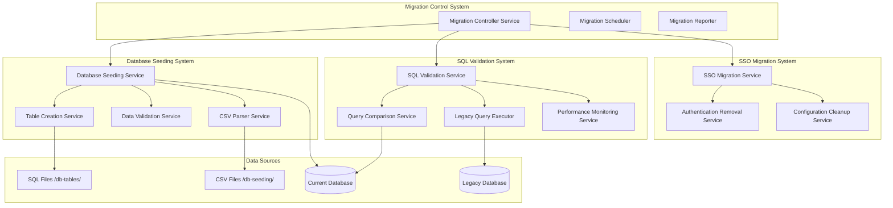
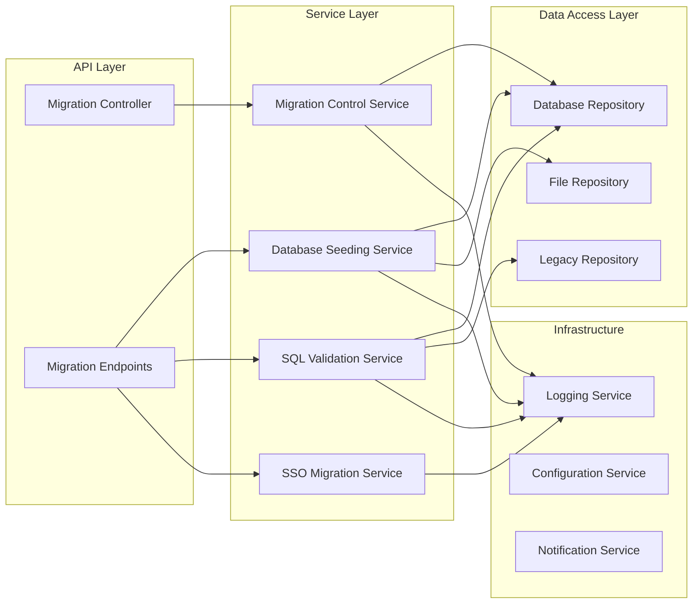

# Design Document

## Overview

This design outlines the architecture for a comprehensive database migration system that includes complete data seeding, SQL validation against legacy systems, and preparation for SSO integration. The system will ensure data consistency, maintain audit trails, and provide a smooth transition path from JWT authentication to Active Directory SSO.

## Architecture

### High-Level Architecture



### Component Architecture



## Components and Interfaces

### 1. Migration Control Service

**Purpose:** Orchestrates the entire migration process and provides centralized control.

**Key Interfaces:**
```csharp
public interface IMigrationControlService
{
    Task<MigrationResult> ExecuteFullMigrationAsync(MigrationOptions options);
    Task<MigrationStatus> GetMigrationStatusAsync();
    Task<bool> CancelMigrationAsync();
    Task<MigrationReport> GenerateReportAsync();
}

public class MigrationOptions
{
    public bool ClearExistingData { get; set; } = true;
    public bool CreateMissingTables { get; set; } = true;
    public bool ValidateAgainstLegacy { get; set; } = true;
    public bool RemoveAuthentication { get; set; } = false;
    public string[] IncludeTables { get; set; } = Array.Empty<string>();
    public string[] ExcludeTables { get; set; } = Array.Empty<string>();
}
```

### 2. Database Seeding Service

**Purpose:** Handles complete database seeding from CSV files with table creation support.

**Key Interfaces:**
```csharp
public interface IDatabaseSeedingService
{
    Task<SeedingResult> SeedAllTablesAsync(SeedingOptions options);
    Task<SeedingResult> SeedTableAsync(string tableName, SeedingOptions options);
    Task<TableCreationResult> CreateMissingTablesAsync();
    Task<ValidationResult> ValidateDataIntegrityAsync();
}

public class SeedingOptions
{
    public bool ClearExistingData { get; set; } = true;
    public bool CreateMissingTables { get; set; } = true;
    public int BatchSize { get; set; } = 1000;
    public bool ContinueOnError { get; set; } = true;
    public bool ValidateBeforeInsert { get; set; } = true;
}
```

### 3. SQL Validation Service

**Purpose:** Compares SQL query results between current API and legacy VB.NET application.

**Key Interfaces:**
```csharp
public interface ISqlValidationService
{
    Task<ValidationResult> ValidateAllQueriesAsync();
    Task<QueryComparisonResult> CompareQueryAsync(string queryName, string currentQuery, string legacyQuery);
    Task<PerformanceComparisonResult> ComparePerformanceAsync(string queryName);
    Task<ValidationReport> GenerateValidationReportAsync();
}

public class QueryComparisonResult
{
    public string QueryName { get; set; }
    public bool DataMatches { get; set; }
    public int CurrentRowCount { get; set; }
    public int LegacyRowCount { get; set; }
    public List<DataDiscrepancy> Discrepancies { get; set; }
    public TimeSpan CurrentExecutionTime { get; set; }
    public TimeSpan LegacyExecutionTime { get; set; }
}
```

### 4. SSO Migration Service

**Purpose:** Removes JWT authentication and prepares for Active Directory integration.

**Key Interfaces:**
```csharp
public interface ISsoMigrationService
{
    Task<AuthRemovalResult> RemoveJwtAuthenticationAsync();
    Task<ConfigCleanupResult> CleanupAuthConfigurationAsync();
    Task<FrontendUpdateResult> UpdateFrontendAuthAsync();
    Task<BackupResult> BackupCurrentAuthConfigAsync();
}

public class AuthRemovalResult
{
    public bool Success { get; set; }
    public List<string> RemovedComponents { get; set; }
    public List<string> ModifiedFiles { get; set; }
    public List<string> BackupFiles { get; set; }
    public string BackupLocation { get; set; }
}
```

## Data Models

### Migration Models

```csharp
public class MigrationResult
{
    public Guid MigrationId { get; set; }
    public DateTime StartTime { get; set; }
    public DateTime? EndTime { get; set; }
    public MigrationStatus Status { get; set; }
    public SeedingResult SeedingResult { get; set; }
    public ValidationResult ValidationResult { get; set; }
    public AuthRemovalResult AuthRemovalResult { get; set; }
    public List<MigrationError> Errors { get; set; }
    public MigrationStatistics Statistics { get; set; }
}

public class SeedingResult
{
    public int TablesProcessed { get; set; }
    public int TablesCreated { get; set; }
    public int RecordsInserted { get; set; }
    public int RecordsSkipped { get; set; }
    public TimeSpan Duration { get; set; }
    public List<TableSeedingResult> TableResults { get; set; }
}

public class TableSeedingResult
{
    public string TableName { get; set; }
    public bool Success { get; set; }
    public int RecordsProcessed { get; set; }
    public int RecordsInserted { get; set; }
    public int RecordsSkipped { get; set; }
    public List<string> Errors { get; set; }
    public TimeSpan Duration { get; set; }
}
```

### Validation Models

```csharp
public class ValidationResult
{
    public int QueriesValidated { get; set; }
    public int QueriesMatched { get; set; }
    public int QueriesFailed { get; set; }
    public List<QueryComparisonResult> Results { get; set; }
    public ValidationSummary Summary { get; set; }
}

public class DataDiscrepancy
{
    public string FieldName { get; set; }
    public object CurrentValue { get; set; }
    public object LegacyValue { get; set; }
    public string RowIdentifier { get; set; }
    public DiscrepancyType Type { get; set; }
}

public enum DiscrepancyType
{
    ValueMismatch,
    MissingInCurrent,
    MissingInLegacy,
    TypeMismatch,
    FormatDifference
}
```

## Error Handling

### Error Classification

1. **Critical Errors**: Stop entire migration process
   - Database connection failures
   - File system access errors
   - Configuration corruption

2. **Table-Level Errors**: Skip current table, continue with others
   - CSV parsing errors
   - Table creation failures
   - Data validation failures

3. **Record-Level Errors**: Skip current record, continue with table
   - Data type conversion errors
   - Constraint violations
   - Duplicate key errors

### Error Recovery Strategies

```csharp
public class ErrorRecoveryStrategy
{
    public ErrorLevel Level { get; set; }
    public RecoveryAction Action { get; set; }
    public int MaxRetries { get; set; }
    public TimeSpan RetryDelay { get; set; }
    public bool ContinueOnFailure { get; set; }
}

public enum RecoveryAction
{
    Retry,
    Skip,
    Abort,
    Prompt,
    UseDefault
}
```

## Testing Strategy

### Unit Testing

1. **Service Layer Testing**
   - Mock database connections
   - Test error handling scenarios
   - Validate data transformation logic
   - Test configuration parsing

2. **Data Validation Testing**
   - Test CSV parsing with malformed data
   - Test SQL query comparison logic
   - Test authentication removal scenarios

### Integration Testing

1. **Database Integration**
   - Test with real database connections
   - Test table creation and seeding
   - Test transaction rollback scenarios

2. **File System Integration**
   - Test CSV file reading
   - Test SQL script execution
   - Test backup and restore operations

### End-to-End Testing

1. **Full Migration Testing**
   - Test complete migration process
   - Test migration cancellation
   - Test recovery from failures

2. **Legacy Comparison Testing**
   - Test against actual legacy database
   - Validate query result consistency
   - Test performance comparisons

## Performance Considerations

### Database Operations

1. **Batch Processing**
   - Process CSV data in configurable batches (default: 1000 records)
   - Use bulk insert operations where possible
   - Implement connection pooling

2. **Memory Management**
   - Stream large CSV files instead of loading entirely into memory
   - Dispose of database connections properly
   - Implement garbage collection hints for large operations

### Parallel Processing

1. **Table-Level Parallelism**
   - Process independent tables in parallel
   - Respect foreign key dependencies
   - Limit concurrent operations based on system resources

2. **Query Validation Parallelism**
   - Run legacy and current queries in parallel
   - Implement timeout mechanisms
   - Queue validation tasks to prevent resource exhaustion

## Security Considerations

### Authentication Removal

1. **Backup Strategy**
   - Create complete backup of current authentication system
   - Store backups in secure, versioned location
   - Maintain rollback capability

2. **Gradual Removal**
   - Remove authentication in phases
   - Maintain audit trail of changes
   - Implement temporary bypass mechanisms for testing

### Data Security

1. **Sensitive Data Handling**
   - Identify and protect sensitive data during migration
   - Implement data masking for non-production environments
   - Ensure secure deletion of temporary files

2. **Access Control**
   - Restrict migration operations to authorized users
   - Log all migration activities
   - Implement approval workflows for production migrations

## Monitoring and Logging

### Real-Time Monitoring

1. **Progress Tracking**
   - Real-time progress indicators
   - Estimated completion times
   - Resource utilization metrics

2. **Health Monitoring**
   - Database connection health
   - File system availability
   - Memory and CPU usage

### Comprehensive Logging

1. **Operation Logging**
   - All migration operations with timestamps
   - Detailed error messages with context
   - Performance metrics and statistics

2. **Audit Trail**
   - Complete record of all changes made
   - User actions and system responses
   - Configuration changes and their impacts