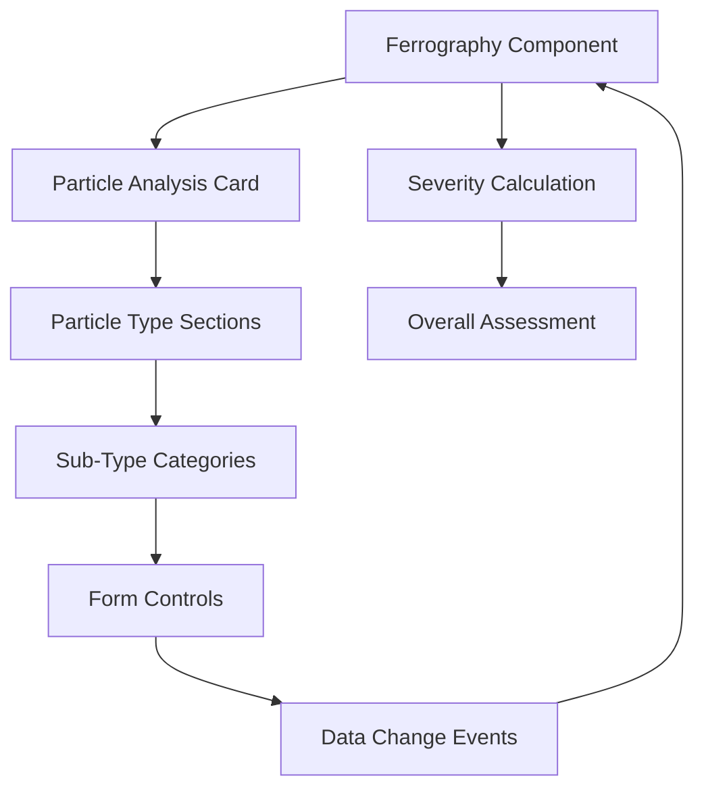

# Ferrography Particle Analysis Integration - Design Document

## Overview

This design document outlines the architecture and implementation approach for creating a reusable particle-analysis-card component and integrating it into the ferrography-test-entry component. The solution involves extracting existing particle analysis functionality, creating a reusable component, and implementing proper data flow and integration patterns.

## Architecture

### Component Hierarchy

```
ferrography-test-entry
├── sample-info-card (existing)
├── dilution-factor-card (existing)
├── overall-assessment-card (existing)
├── particle-analysis-card (new)
│   ├── particle-type-section (multiple)
│   │   ├── particle-header
│   │   ├── particle-images
│   │   ├── analysis-fields
│   │   └── comments-field
│   └── severity-summary
└── action-buttons (existing)
```

### Data Flow Architecture



## Components and Interfaces

### 1. Particle Analysis Card Component

**File Structure:**
```
src/app/shared/components/particle-analysis-card/
├── particle-analysis-card.component.ts
├── particle-analysis-card.component.html
├── particle-analysis-card.component.scss
└── particle-analysis-card.component.spec.ts
```

**Component Interface:**
```typescript
@Component({
  selector: 'app-particle-analysis-card',
  standalone: true,
  imports: [SharedModule]
})
export class ParticleAnalysisCardComponent implements OnInit, OnDestroy {
  // Inputs
  @Input() particleTypes: ParticleTypeDefinition[] = [];
  @Input() subTypeCategories: ParticleSubTypeCategory[] = [];
  @Input() initialData: ParticleAnalysisData | null = null;
  @Input() readonly: boolean = false;
  @Input() showImages: boolean = true;
  @Input() viewFilter: 'all' | 'review' = 'all';

  // Outputs
  @Output() particleDataChange = new EventEmitter<ParticleAnalysisData>();
  @Output() severityChange = new EventEmitter<number>();
  @Output() validationChange = new EventEmitter<boolean>();

  // Internal state
  particleAnalysisForm: FormGroup;
  filteredParticleTypes = computed(() => this.filterParticleTypes());
  overallSeverity = computed(() => this.calculateOverallSeverity());
}
```

### 2. Data Models

**Particle Analysis Data Structure:**
```typescript
interface ParticleAnalysisData {
  analyses: ParticleAnalysis[];
  overallSeverity: number;
  isValid: boolean;
  summary: {
    totalParticles: number;
    criticalParticles: number;
    recommendations: string[];
  };
}

interface ParticleAnalysis {
  particleTypeId: number;
  subTypeValues: { [categoryId: number]: number | null };
  comments: string;
  severity: number;
  status: 'active' | 'review' | 'complete';
}

interface ParticleTypeDefinition {
  id: number;
  type: string;
  description: string;
  image1: string;
  image2: string;
  active: boolean;
  sortOrder: number;
  category: 'wear' | 'oxide' | 'contaminant' | 'other';
}

interface ParticleSubTypeCategory {
  id: number;
  description: string;
  active: boolean;
  sortOrder: number;
  subTypes: ParticleSubTypeDefinition[];
}
```

### 3. Ferrography Integration

**Updated Ferrography Component Structure:**
```typescript
export class FerrographyTestEntryComponent implements OnInit, OnDestroy {
  // Existing properties...
  
  // New particle analysis properties
  particleAnalysisData = signal<ParticleAnalysisData | null>(null);
  particleTypes = signal<ParticleTypeDefinition[]>([]);
  subTypeCategories = signal<ParticleSubTypeCategory[]>([]);
  
  // Updated form structure
  ferrographyForm: FormGroup = this.fb.group({
    dilutionFactor: [''],
    customDilutionFactor: [''],
    overallSeverity: [null],
    overallComments: [''],
    particleAnalysis: [null] // New form control for particle data
  });

  // Event handlers
  onParticleDataChange(data: ParticleAnalysisData): void;
  onParticleSeverityChange(severity: number): void;
  private updateOverallSeverity(): void;
}
```

## Data Models

### Particle Type Configuration for Ferrography

```typescript
const FERROGRAPHY_PARTICLE_TYPES: ParticleTypeDefinition[] = [
  {
    id: 1,
    type: 'Cutting Wear',
    description: 'Normal machining wear particles with sharp edges',
    category: 'wear',
    image1: '/assets/particles/cutting-wear-1.jpg',
    image2: '/assets/particles/cutting-wear-2.jpg',
    active: true,
    sortOrder: 1
  },
  {
    id: 2,
    type: 'Sliding Wear',
    description: 'Adhesive wear particles from sliding contact',
    category: 'wear',
    image1: '/assets/particles/sliding-wear-1.jpg',
    image2: '/assets/particles/sliding-wear-2.jpg',
    active: true,
    sortOrder: 2
  },
  {
    id: 3,
    type: 'Severe Sliding',
    description: 'Large sliding wear particles indicating severe wear',
    category: 'wear',
    image1: '/assets/particles/severe-sliding-1.jpg',
    image2: '/assets/particles/severe-sliding-2.jpg',
    active: true,
    sortOrder: 3
  },
  {
    id: 4,
    type: 'Fatigue Particles',
    description: 'Particles from surface fatigue and spalling',
    category: 'wear',
    image1: '/assets/particles/fatigue-1.jpg',
    image2: '/assets/particles/fatigue-2.jpg',
    active: true,
    sortOrder: 4
  },
  {
    id: 5,
    type: 'Spherical Particles',
    description: 'Rolling contact fatigue particles',
    category: 'wear',
    image1: '/assets/particles/spherical-1.jpg',
    image2: '/assets/particles/spherical-2.jpg',
    active: true,
    sortOrder: 5
  },
  {
    id: 6,
    type: 'Dark Metallic Oxides',
    description: 'Oxidized iron particles from wear surfaces',
    category: 'oxide',
    image1: '/assets/particles/dark-oxide-1.jpg',
    image2: '/assets/particles/dark-oxide-2.jpg',
    active: true,
    sortOrder: 6
  },
  {
    id: 7,
    type: 'Red Oxides',
    description: 'Rust particles from corrosion processes',
    category: 'oxide',
    image1: '/assets/particles/red-oxide-1.jpg',
    image2: '/assets/particles/red-oxide-2.jpg',
    active: true,
    sortOrder: 7
  },
  {
    id: 8,
    type: 'Nonferrous Particles',
    description: 'Copper, aluminum, and other nonferrous metal particles',
    category: 'wear',
    image1: '/assets/particles/nonferrous-1.jpg',
    image2: '/assets/particles/nonferrous-2.jpg',
    active: true,
    sortOrder: 8
  },
  {
    id: 9,
    type: 'Fibers',
    description: 'Organic or synthetic fibers from seals and filters',
    category: 'contaminant',
    image1: '/assets/particles/fibers-1.jpg',
    image2: '/assets/particles/fibers-2.jpg',
    active: true,
    sortOrder: 9
  },
  {
    id: 10,
    type: 'Contaminants',
    description: 'External contamination particles (dirt, sand, etc.)',
    category: 'contaminant',
    image1: '/assets/particles/contaminants-1.jpg',
    image2: '/assets/particles/contaminants-2.jpg',
    active: true,
    sortOrder: 10
  }
];
```

### Sub-Type Categories (Legacy System Integration)

The particle sub-type categories are determined dynamically based on the legacy system's approach using the Control_Data table and particle sub-type definition tables. This ensures compatibility with existing data and maintains the flexibility of the original system.

#### Legacy System Structure

The Control_Data table contains two key configuration values:
- **PSTCats1**: `"[Heat],[Concentration],[Size, Ave],[Size, Max],"`
- **PSTCats2**: `"[Color],[Texture],[Composition],[Severity]"`

These values define which particle sub-type categories are available for analysis, allowing different configurations for different test types or installations.

#### Database Tables Integration

```typescript
// Control_Data table structure
interface ControlData {
  id: number;
  name: string;
  controlValue: string;
}

// Particle Sub-Type Category Definition table
interface ParticleSubTypeCategoryDefinition {
  id: number;
  description: string;
  active: boolean;
  sortOrder: number;
}

// Particle Sub-Type Definition table
interface ParticleSubTypeDefinition {
  particleSubTypeCategoryId: number;
  value: number;
  description: string;
  active: boolean;
  sortOrder: number;
}
```

#### Dynamic Category Loading

```typescript
class ParticleSubTypeCategoryService {
  async getAvailableCategories(testId: number): Promise<ParticleSubTypeCategory[]> {
    // 1. Get PSTCats1 and PSTCats2 from Control_Data table
    const pstCats1 = await this.getControlValue('PSTCats1');
    const pstCats2 = await this.getControlValue('PSTCats2');
    
    // 2. Parse category names from control values
    const categoryNames = this.parseCategoryNames(pstCats1, pstCats2);
    
    // 3. Get category definitions from particle-sub-type-category-definition table
    const categoryDefinitions = await this.getCategoryDefinitions(categoryNames);
    
    // 4. Get sub-type definitions for each category
    const categories = await Promise.all(
      categoryDefinitions.map(async (category) => ({
        ...category,
        subTypes: await this.getSubTypeDefinitions(category.id)
      }))
    );
    
    return categories.sort((a, b) => a.sortOrder - b.sortOrder);
  }

  private parseCategoryNames(pstCats1: string, pstCats2: string): string[] {
    // Parse "[Heat],[Concentration],[Size, Ave],[Size, Max]," format
    const parseCategories = (catString: string): string[] => {
      return catString
        .split(',')
        .map(cat => cat.replace(/[\[\]]/g, '').trim())
        .filter(cat => cat.length > 0);
    };
    
    return [
      ...parseCategories(pstCats1),
      ...parseCategories(pstCats2)
    ];
  }

  private async getCategoryDefinitions(categoryNames: string[]): Promise<ParticleSubTypeCategoryDefinition[]> {
    // Query particle-sub-type-category-definition table
    return await this.db.query(`
      SELECT * FROM ParticleSubTypeCategoryDefinition 
      WHERE Description IN (${categoryNames.map(name => `'${name}'`).join(',')})
      AND Active = 1
      ORDER BY SortOrder
    `);
  }

  private async getSubTypeDefinitions(categoryId: number): Promise<ParticleSubTypeDefinition[]> {
    // Query particle-sub-type-definition table
    return await this.db.query(`
      SELECT * FROM ParticleSubTypeDefinition 
      WHERE ParticleSubTypeCategoryID = ${categoryId}
      AND Active = 1
      ORDER BY SortOrder
    `);
  }
}
```

#### Example Category Configuration

Based on the seeded data, the available categories are:

**PSTCats1 Categories:**
1. **Heat** (ID: 2) - NA, Blue, Straw, Purple, No Change, Melted, Charred
2. **Concentration** (ID: 3) - Few, Moderate, Many, Heavy  
3. **Size, Ave** (ID: 4) - Fine (<5μm), Small (5-15μm), Medium (15-40μm), Large (40-100μm), Huge (>100μm)
4. **Size, Max** (ID: 5) - Fine (<5μm), Small (5-15μm), Medium (15-40μm), Large (40-100μm), Huge (>100μm)

**PSTCats2 Categories:**
5. **Color** (ID: 6) - Red, Black, Tempered, Metallic, Straw, Copper, Brass, Other Color
6. **Texture** (ID: 7) - Bright/Reflective, Dull/Oxidized, Pitted, Striated, Smeared, Amorphous, Other Texture
7. **Composition** (ID: 8) - Ferrous Metal, Cupric Metal, Other Metal, Dust, Organic, Sludge, Paint Chips, Other Material
8. **Severity** (ID: 1) - 1, 2, 3, 4

#### API Integration

```typescript
// TestService method to get categories for specific test
async getParticleSubTypeCategories(testId: number): Promise<ParticleSubTypeCategory[]> {
  const response = await this.http.get<ParticleSubTypeCategory[]>(
    `/api/tests/${testId}/particle-sub-type-categories`
  );
  return response;
}

// Backend API endpoint
@Get('tests/:testId/particle-sub-type-categories')
async getParticleSubTypeCategories(@Param('testId') testId: number) {
  return await this.particleSubTypeCategoryService.getAvailableCategories(testId);
}
```

This approach ensures:
- **Compatibility**: Maintains compatibility with existing legacy data
- **Flexibility**: Allows different category configurations per test type
- **Extensibility**: New categories can be added through database configuration
- **Data Integrity**: Uses existing validated category and sub-type definitions

#### Component Implementation for Dynamic Categories

The particle analysis card component will load categories dynamically based on the test type:

```typescript
export class ParticleAnalysisCardComponent implements OnInit {
  @Input() testId: number = 0;
  @Input() particleTypes: ParticleTypeDefinition[] = [];
  @Input() initialData: ParticleAnalysisData | null = null;
  
  subTypeCategories = signal<ParticleSubTypeCategory[]>([]);
  
  ngOnInit(): void {
    this.loadParticleSubTypeCategories();
  }

  private loadParticleSubTypeCategories(): void {
    this.testService.getParticleSubTypeCategories(this.testId).subscribe({
      next: (categories) => {
        this.subTypeCategories.set(categories);
        this.initializeParticleAnalysisForm();
      },
      error: (error) => {
        this.handleCategoryLoadError(error);
      }
    });
  }

  private handleCategoryLoadError(error: any): void {
    console.error('Failed to load particle categories:', error);
    // Fallback to default categories based on most common configuration
    this.loadDefaultCategories();
  }

  // Helper methods to get specific category options
  getCategoryOptions(categoryDescription: string): ParticleSubTypeDefinition[] {
    const category = this.subTypeCategories().find(cat => 
      cat.description.toLowerCase() === categoryDescription.toLowerCase()
    );
    return category?.subTypes || [];
  }

  // Dynamic option getters based on loaded categories
  getHeatOptions(): ParticleSubTypeDefinition[] {
    return this.getCategoryOptions('Heat');
  }

  getConcentrationOptions(): ParticleSubTypeDefinition[] {
    return this.getCategoryOptions('Concentration');
  }

  getSizeAverageOptions(): ParticleSubTypeDefinition[] {
    return this.getCategoryOptions('Size, Ave');
  }

  getSeverityOptions(): ParticleSubTypeDefinition[] {
    return this.getCategoryOptions('Severity');
  }
}
```

#### Template Implementation for Dynamic Categories

The template will render form fields dynamically based on loaded categories:

```html
<div class="particle-analysis-fields">
  @for (category of subTypeCategories(); track category.id) {
    <div class="analysis-field">
      <mat-form-field appearance="outline">
        <mat-label>{{ category.description }}</mat-label>
        <mat-select [formControlName]="'category_' + category.id">
          <mat-option [value]="null">Not Applicable</mat-option>
          @for (subType of category.subTypes; track subType.value) {
            <mat-option [value]="subType.value">
              {{ subType.description }}
            </mat-option>
          }
        </mat-select>
      </mat-form-field>
    </div>
  }
</div>
```

## Error Handling

### Error Scenarios and Handling

1. **Data Loading Errors**
   - Display error message in particle analysis card
   - Provide retry mechanism
   - Fallback to default particle types

2. **Form Validation Errors**
   - Real-time validation feedback
   - Highlight invalid fields
   - Prevent form submission with invalid data

3. **Data Persistence Errors**
   - Show error notification
   - Preserve user input
   - Provide manual retry option

4. **Image Loading Errors**
   - Display placeholder images
   - Graceful degradation without images
   - Log errors for monitoring

### Error Handling Implementation

```typescript
// Error handling service integration
export class ParticleAnalysisCardComponent {
  private handleDataLoadError(error: any): void {
    this.errorState.set({
      type: 'data-load',
      message: 'Failed to load particle analysis data',
      details: error.message,
      retryAction: () => this.loadParticleData()
    });
  }

  private handleValidationError(field: string, error: any): void {
    this.validationErrors.update(errors => ({
      ...errors,
      [field]: error.message
    }));
  }
}
```

## Testing Strategy

### Unit Testing

1. **Component Testing**
   - Test component initialization
   - Test input/output bindings
   - Test form validation logic
   - Test severity calculations

2. **Service Testing**
   - Test data transformation methods
   - Test API integration
   - Test error handling

3. **Utility Testing**
   - Test severity mapping functions
   - Test data validation utilities
   - Test form helper functions

### Integration Testing

1. **Component Integration**
   - Test particle analysis card in ferrography component
   - Test data flow between components
   - Test form integration and validation

2. **Service Integration**
   - Test API calls and data handling
   - Test error scenarios and recovery
   - Test data persistence and retrieval

### End-to-End Testing

1. **User Workflows**
   - Complete ferrography test with particle analysis
   - Save and load existing results
   - Form validation and error handling
   - Responsive design testing

2. **Data Integrity**
   - Test data persistence across sessions
   - Test form reset and clear functionality
   - Test concurrent user scenarios

### Testing Implementation

```typescript
// Example unit test structure
describe('ParticleAnalysisCardComponent', () => {
  let component: ParticleAnalysisCardComponent;
  let fixture: ComponentFixture<ParticleAnalysisCardComponent>;

  beforeEach(() => {
    TestBed.configureTestingModule({
      imports: [ParticleAnalysisCardComponent, SharedModule]
    });
    fixture = TestBed.createComponent(ParticleAnalysisCardComponent);
    component = fixture.componentInstance;
  });

  describe('Data Binding', () => {
    it('should accept particle types input', () => {
      const mockParticleTypes = [/* mock data */];
      component.particleTypes = mockParticleTypes;
      expect(component.particleTypes).toEqual(mockParticleTypes);
    });

    it('should emit particle data changes', () => {
      spyOn(component.particleDataChange, 'emit');
      component.onParticleChange(/* mock data */);
      expect(component.particleDataChange.emit).toHaveBeenCalled();
    });
  });

  describe('Severity Calculation', () => {
    it('should calculate overall severity correctly', () => {
      // Test severity calculation logic
    });
  });
});
```

## Performance Considerations

### Optimization Strategies

1. **Change Detection Optimization**
   - Use OnPush change detection strategy
   - Implement trackBy functions for ngFor loops
   - Use signals for reactive state management

2. **Data Loading Optimization**
   - Lazy load particle images
   - Cache particle type definitions
   - Implement virtual scrolling for large datasets

3. **Form Performance**
   - Debounce form value changes
   - Optimize form validation
   - Use reactive forms for better performance

4. **Memory Management**
   - Proper subscription cleanup
   - Avoid memory leaks in event handlers
   - Optimize component lifecycle

### Performance Implementation

```typescript
// Performance optimizations
@Component({
  changeDetection: ChangeDetectionStrategy.OnPush,
  // ...
})
export class ParticleAnalysisCardComponent {
  // Use trackBy for performance
  trackByParticleId(index: number, particle: ParticleTypeDefinition): number {
    return particle.id;
  }

  // Debounce form changes
  private setupFormChangeHandling(): void {
    this.particleAnalysisForm.valueChanges
      .pipe(
        debounceTime(300),
        distinctUntilChanged(),
        takeUntil(this.destroy$)
      )
      .subscribe(value => this.onFormChange(value));
  }
}
```

## Security Considerations

### Data Validation

1. **Input Sanitization**
   - Sanitize all user inputs
   - Validate particle type data
   - Prevent XSS attacks in comments

2. **Form Security**
   - Implement proper form validation
   - Prevent injection attacks
   - Validate file uploads (if applicable)

3. **API Security**
   - Validate API responses
   - Handle authentication properly
   - Implement proper error handling

### Security Implementation

```typescript
// Security measures
export class ParticleAnalysisCardComponent {
  private sanitizeInput(input: string): string {
    // Implement input sanitization
    return this.sanitizer.sanitize(SecurityContext.HTML, input) || '';
  }

  private validateParticleData(data: ParticleAnalysisData): boolean {
    // Implement data validation
    return this.validator.validate(data);
  }
}
```

## Deployment Considerations

### Build Configuration

1. **Asset Management**
   - Optimize particle images
   - Implement proper asset caching
   - Configure CDN for image delivery

2. **Bundle Optimization**
   - Tree shake unused code
   - Optimize component imports
   - Implement code splitting

3. **Environment Configuration**
   - Configure API endpoints
   - Set up environment-specific settings
   - Implement feature flags

### Deployment Strategy

1. **Gradual Rollout**
   - Feature flag for particle analysis integration
   - A/B testing for user experience
   - Rollback capability

2. **Monitoring**
   - Performance monitoring
   - Error tracking
   - User behavior analytics

3. **Documentation**
   - User documentation updates
   - API documentation
   - Deployment guides

This design provides a comprehensive foundation for implementing the particle analysis integration while maintaining code quality, performance, and user experience standards.