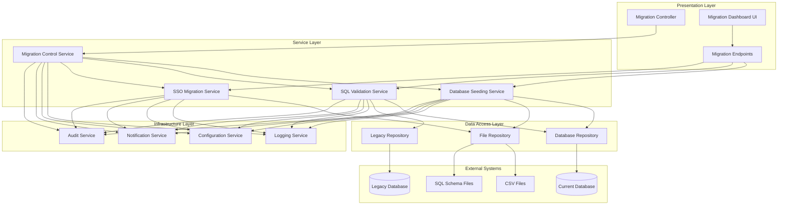
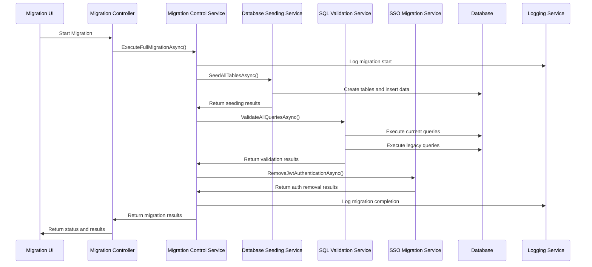
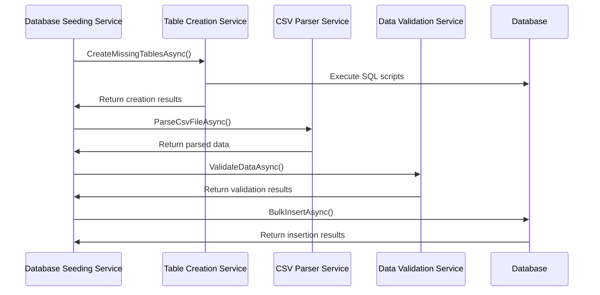

# Migration System Architecture

## Overview

The Database Migration and SSO System is a comprehensive solution for migrating laboratory test data, validating SQL queries against legacy systems, and preparing for Single Sign-On integration. The system is built using a modular architecture that ensures reliability, maintainability, and extensibility.

## System Architecture

### High-Level Architecture



### Component Architecture

The system follows a layered architecture pattern with clear separation of concerns:

#### 1. Presentation Layer
- **Migration Controller**: REST API endpoints for migration operations
- **Migration Dashboard**: Angular-based UI for monitoring and controlling migrations
- **API Documentation**: Swagger/OpenAPI documentation for all endpoints

#### 2. Service Layer
- **Migration Control Service**: Orchestrates the entire migration process
- **Database Seeding Service**: Handles CSV data import and table creation
- **SQL Validation Service**: Compares queries between current and legacy systems
- **SSO Migration Service**: Manages authentication system changes

#### 3. Data Access Layer
- **Database Repository**: Handles current database operations
- **File Repository**: Manages CSV and SQL file operations
- **Legacy Repository**: Connects to and queries legacy VB.NET database

#### 4. Infrastructure Layer
- **Logging Service**: Comprehensive logging and audit trail
- **Configuration Service**: Manages migration settings and options
- **Notification Service**: Handles alerts and notifications
- **Audit Service**: Tracks all migration activities

## Core Components

### Migration Control Service

**Responsibility**: Central orchestration of all migration activities

**Key Features**:
- Process coordination and sequencing
- Status tracking and progress reporting
- Error handling and recovery
- Cancellation support
- Report generation

**Dependencies**:
- Database Seeding Service
- SQL Validation Service
- SSO Migration Service
- Logging Service
- Configuration Service

### Database Seeding Service

**Responsibility**: Complete database population from CSV files

**Key Features**:
- CSV file parsing and validation
- Automatic table creation from SQL scripts
- Batch processing for large datasets
- Data integrity validation
- Transaction management with rollback

**Components**:
- **CSV Parser Service**: Handles CSV file reading and data conversion
- **Table Creation Service**: Executes SQL scripts to create missing tables
- **Data Validation Service**: Validates data integrity before insertion
- **Batch Processor**: Manages large dataset processing in chunks

### SQL Validation Service

**Responsibility**: Ensures query consistency between current and legacy systems

**Key Features**:
- Query result comparison
- Performance benchmarking
- Discrepancy detection and reporting
- Legacy database connectivity
- Automated validation reporting

**Components**:
- **Query Comparison Service**: Compares result sets between systems
- **Legacy Query Executor**: Executes queries against legacy VB.NET database
- **Performance Monitor**: Tracks and compares query execution times
- **Validation Reporter**: Generates detailed comparison reports

### SSO Migration Service

**Responsibility**: Prepares system for Active Directory integration

**Key Features**:
- JWT authentication removal
- Configuration cleanup
- Frontend authentication updates
- Backup and rollback capabilities
- Change documentation

**Components**:
- **Authentication Removal Service**: Removes JWT middleware and services
- **Configuration Cleanup Service**: Cleans authentication configuration
- **Frontend Update Service**: Updates Angular authentication components
- **Backup Service**: Creates and manages configuration backups

## Data Flow

### Migration Process Flow



### Data Seeding Flow



## Configuration Management

### Configuration Structure

```json
{
  "MigrationSettings": {
    "DefaultBatchSize": 1000,
    "MaxConcurrentTables": 5,
    "CommandTimeout": 300,
    "EnableValidation": true,
    "ContinueOnError": true
  },
  "DatabaseSettings": {
    "CurrentConnectionString": "...",
    "LegacyConnectionString": "...",
    "CommandTimeout": 30
  },
  "FileSettings": {
    "CsvDirectory": "/db-seeding/",
    "SqlDirectory": "/db-tables/",
    "BackupDirectory": "/Backups/"
  },
  "NotificationSettings": {
    "EnableEmailNotifications": true,
    "EnableSlackNotifications": false,
    "SmtpSettings": { ... }
  }
}
```

### Environment-Specific Configuration

The system supports environment-specific configuration through:
- `appsettings.json` (base configuration)
- `appsettings.Development.json` (development overrides)
- `appsettings.Staging.json` (staging overrides)
- `appsettings.Production.json` (production overrides)

## Security Architecture

### Authentication and Authorization

- **Development**: No authentication required for migration endpoints
- **Staging/Production**: Role-based access control for migration operations
- **Audit Trail**: All operations logged with user context

### Data Security

- **Sensitive Data**: Automatic detection and masking in logs
- **Backup Security**: Encrypted backups with secure storage
- **Connection Security**: Encrypted database connections
- **File Security**: Secure file handling with proper permissions

## Performance Architecture

### Scalability Features

- **Parallel Processing**: Independent tables processed concurrently
- **Batch Processing**: Large datasets processed in configurable batches
- **Memory Management**: Streaming for large files to minimize memory usage
- **Connection Pooling**: Efficient database connection management

### Performance Monitoring

- **Real-time Metrics**: Progress tracking and performance indicators
- **Resource Monitoring**: CPU, memory, and disk usage tracking
- **Query Performance**: Execution time tracking and comparison
- **Bottleneck Detection**: Automatic identification of performance issues

## Error Handling Architecture

### Error Classification

1. **System Errors**: Infrastructure failures (database, file system)
2. **Data Errors**: Data validation and integrity issues
3. **Configuration Errors**: Invalid settings or missing dependencies
4. **Business Logic Errors**: Validation rule violations

### Recovery Strategies

- **Automatic Retry**: Transient errors with exponential backoff
- **Graceful Degradation**: Continue processing when possible
- **Transaction Rollback**: Atomic operations with rollback capability
- **Manual Intervention**: Clear guidance for manual resolution

## Monitoring and Observability

### Logging Strategy

- **Structured Logging**: JSON-formatted logs with consistent schema
- **Log Levels**: Trace, Debug, Information, Warning, Error, Critical
- **Contextual Logging**: Correlation IDs for tracking operations
- **Performance Logging**: Execution times and resource usage

### Metrics and Monitoring

- **Application Metrics**: Custom metrics for migration operations
- **System Metrics**: CPU, memory, disk, and network usage
- **Database Metrics**: Connection pool, query performance, deadlocks
- **Business Metrics**: Records processed, validation results, error rates

## Deployment Architecture

### Deployment Models

1. **Standalone Deployment**: Migration system as separate application
2. **Integrated Deployment**: Migration system within main API
3. **Containerized Deployment**: Docker containers with orchestration

### Environment Requirements

- **.NET 8.0**: Runtime environment
- **SQL Server**: Database engine (current and legacy)
- **File System**: Access to CSV and SQL files
- **Network**: Connectivity to legacy systems

## Extension Points

### Custom Validators

```csharp
public interface ICustomValidator
{
    Task<ValidationResult> ValidateAsync(object data, ValidationContext context);
}
```

### Custom Processors

```csharp
public interface ICustomProcessor
{
    Task<ProcessingResult> ProcessAsync(ProcessingContext context);
}
```

### Custom Notifiers

```csharp
public interface ICustomNotifier
{
    Task NotifyAsync(NotificationContext context);
}
```

## Technology Stack

### Backend Technologies
- **Framework**: ASP.NET Core 8.0
- **Database**: Entity Framework Core with SQL Server
- **Logging**: Serilog with structured logging
- **Configuration**: ASP.NET Core Configuration
- **Testing**: xUnit, Moq, FluentAssertions

### Frontend Technologies
- **Framework**: Angular 17+
- **UI Components**: Angular Material
- **State Management**: NgRx (if needed)
- **HTTP Client**: Angular HttpClient
- **Testing**: Jasmine, Karma, Protractor

### Infrastructure Technologies
- **Containerization**: Docker
- **Orchestration**: Docker Compose / Kubernetes
- **Monitoring**: Application Insights / Prometheus
- **CI/CD**: Azure DevOps / GitHub Actions

## Best Practices

### Development Best Practices
- **SOLID Principles**: Single responsibility, open/closed, etc.
- **Dependency Injection**: Constructor injection for all dependencies
- **Async/Await**: Asynchronous operations throughout
- **Error Handling**: Comprehensive exception handling
- **Unit Testing**: High test coverage for business logic

### Operational Best Practices
- **Configuration Management**: Environment-specific settings
- **Logging**: Comprehensive logging with correlation IDs
- **Monitoring**: Real-time monitoring and alerting
- **Backup Strategy**: Regular backups with tested restore procedures
- **Documentation**: Up-to-date technical and user documentation

## Future Enhancements

### Planned Features
- **Real-time Synchronization**: Live data sync between systems
- **Advanced Validation**: Machine learning-based anomaly detection
- **Multi-tenant Support**: Support for multiple client databases
- **API Versioning**: Versioned APIs for backward compatibility
- **Advanced Reporting**: Interactive dashboards and analytics

### Scalability Improvements
- **Distributed Processing**: Multi-node processing capabilities
- **Cloud Integration**: Azure/AWS cloud services integration
- **Microservices**: Break down into smaller, focused services
- **Event-Driven Architecture**: Asynchronous event processing